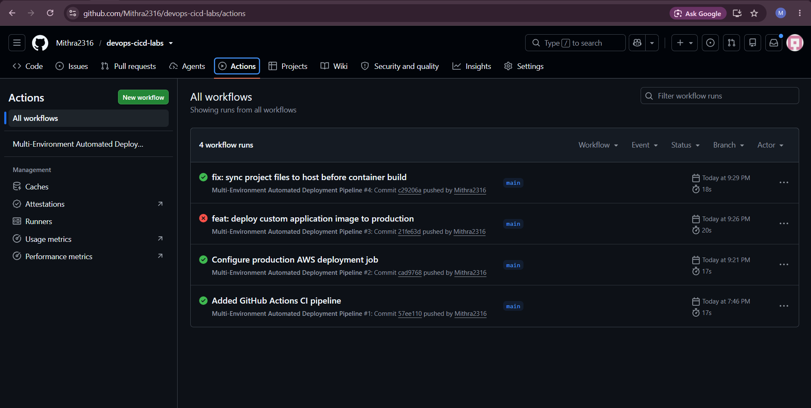
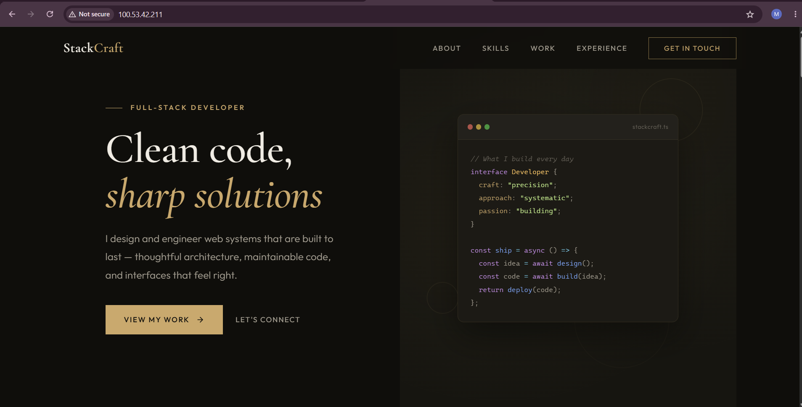

# Multi-Environment Automated Deployment Pipeline

A fully automated CI/CD pipeline built with GitHub Actions, Docker, and AWS EC2.

##  Deployment Proof

### 1. GitHub Actions Workflow Status
Below is the successful execution log showing the dynamic staging/production build execution:

### 2. Live Application Environment
The containerized application running live via the cloud architecture:

---
>  *Note: To optimize cloud resource allocation and manage AWS Free Tier hours, the live EC2 host instance is stopped during inactive periods. Full architectural workflows, Docker configurations, and deployment logs are fully verifiable in the repository files.*